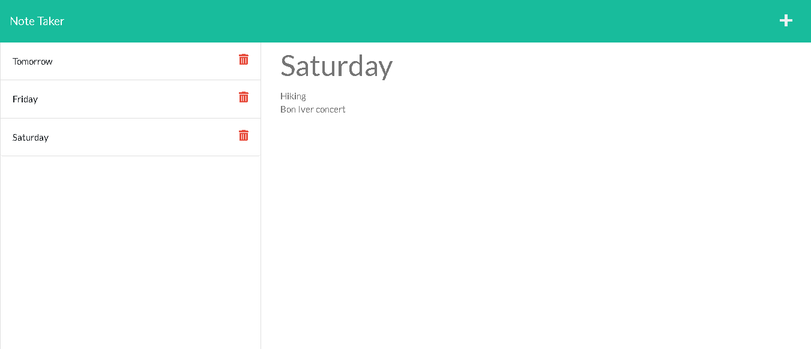
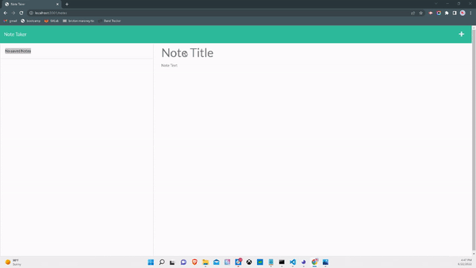

# note-taker

## Table of Contents
1. [Description](#description)
2. [Visuals](#visuals)
3. [Resources](#resources)

## Description

This project allows users to add, save and delete notes that contain a title and description. After adding the starter code to my repository, I created the server.js file. I added variables at the top to connect everything I needed to make it run.

I then added get requests to display the html files based on where the user has navigated to in the site.

I then added another get request to show the existing notes located in the db.json file within the db folder.

I created a post request that takes in the strings of inputed information on the site. Within this request, I added a for loop to add ID's to the notes so that deletion would be possible. I used array's push function and write file to update the array of notes shown to the user when they save a new note.

Lastly, I created a delete request that finds which note in the array has an id that matches the one of the deletion target, and removes that note from the shown array.

## Visuals

Screenshot of a note:

Adding and deleting notes:

## Resources

[Git Hub Repository](https://github.com/vmalie3/note-taker)

[Live Heroku Link](https://enigmatic-mesa-84139.herokuapp.com/)

